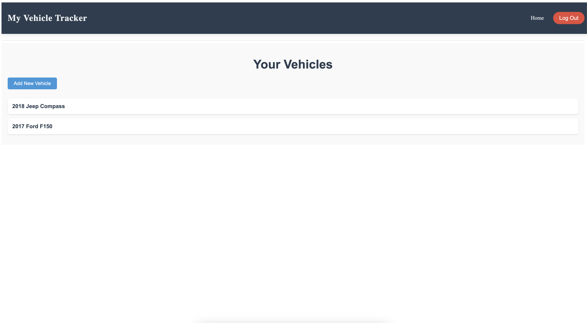

# Vehicle Maintenance Tracker



Vehicle Maintenance Tracker is a robust web application that helps users effortlessly organize and track their vehicle maintenance records, ensuring they stay on top of essential upkeep.

## Features
- **Secure and Persistent Storage**: Safely store your vehicle information and maintenance history in a PostgreSQL database.
- **Intuitive User Interface**: Navigate seamlessly through your records with an easy-to-use design.
- **Comprehensive Maintenance Records**: Track details like mileage, part numbers, product links, costs, and service dates for each vehicle.

## Technologies Used

- **Python** (Django)
- **PostgreSQL**
- **Django Templates, CSS** for the front-end

1. **Clone the Repository**

   Clone the repository to your local machine:

   ```bash
   git clone <repo-url>
   cd <project-directory>
   ```